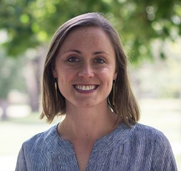
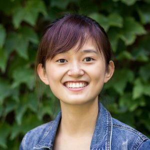
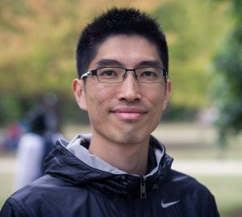

We are a group of L2 researchers who use quantitative methods in our work and think that the world needs some positive energy during these difficult times. We are donating our time to initiate a chain of kindness in the hope that everyone can pay it forward to help somebody else in need. here is some information about us:

---

{width=20%}

[Elizabeth (Lizz) Huntley](https://sites.google.com/view/lizzhuntley/) employs psycholinguistic methods and cognitive measures such as reaction times and eye tracking to understand how L2 Arabic (particularly as a di/multiglossic language) is represented in the mind. As a former Arabic teacher, study abroad coordinator, and textbook writer, she seeks to translate empirical findings to the L2 classroom. Lizz is also the editorial assistant for Studies in Second Language Acquisition.

---

{width=20%}

[Melody (Wenyue) Ma](http://mawenyue.msu.domains/) received her MA in Teaching English to Speakers of Other Languages (TESOL) from Michigan State University and then joined the SLS program in the Fall of 2018. Before her MA studies, she worked as an intern at Disney English in China. Her research interests lie in second language testing and assessment and quantitative research methods. She is currently a graduate teaching assistant for LLT307 (Teaching Methods).

---

{width=20%}

[Bronson Hui](bronson-hui.github.io) is a PhD candidate in Second Language Studies. His research interests include vocabulary acquisition, lexical processing, reading-while-listening, quantitative methods, and open science practices. His work has been accepted or published in Studies in Second Language Acquisition, Applied Psycholinguistics, and Second Language Research. At MSU, he taught LLT 346 Pedagogical Grammar, and LLT 873 Quantitative Research Methods in SLS. Currently, he serves as a graduate student statistical consultant at the Center for Statistical Training and Consulting (CSTAT).